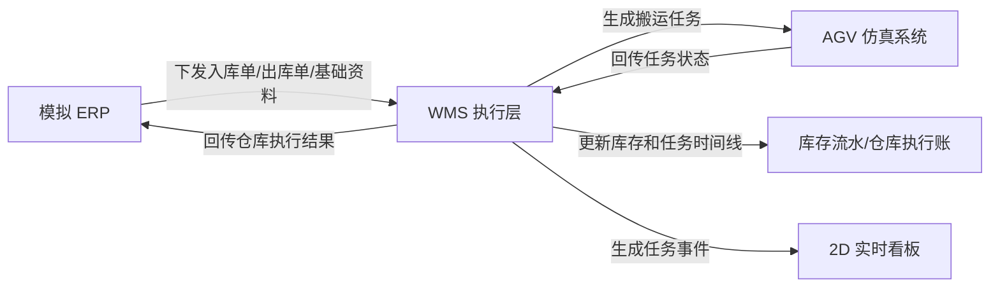

# WMS-AGV 出入库执行仿真系统

英文工作名：WMS AGV Flow Bridge

这是一个结合 WMS 出入库、AGV 搬运和后端工程学习的作品集项目。项目用模拟数据还原一个小型仓库执行闭环：ERP 下发入库单和出库单，WMS 处理单据和库存，AGV 仿真执行搬运任务，最后 WMS 将仓库执行结果回传给模拟 ERP。

## 项目故事

真实仓库现场里，ERP、WMS、AGV 和人工操作经常一起参与一条出入库链路。这个项目不追求复制真实公司系统，而是把核心业务抽象成一个可解释、可运行、可展示的小系统。

第一版目标是跑通两条主线：

- 出库：ERP 下发出库单，WMS 操作员人工下发，WMS 校验库存并生成 AGV 出库任务，AGV 仿真搬运完成，WMS 扣减库存并回传 ERP 仓库执行账。
- 入库：ERP 下发入库单，现场扫码到货，叉车把货放到固定交接点或电梯点，WMS 生成 AGV 入库上架任务，AGV 仿真上架完成，WMS 增加库存并记录库存流水。

## 第一版边界

本项目会做：

- 模拟 ERP 下发基础资料、入库单和出库单。
- 维护物料、库位、交接点位和库存。
- 支持出库人工下发、库存校验、AGV 出库任务和 ERP 回传记录。
- 支持入库扫码到货、交接点暂存、AGV 入库上架和库存入账。
- 记录库存流水、操作日志、异常事件和任务时间线。
- 后期增加 2D 实时可视化看板，用任务事件驱动货车、叉车、AGV、库位和交接点状态变化。

第一版暂时不做：

- 真实 ERP 对接。
- 真实 AGV 协议对接。
- 真实 MES 生产业务。
- 真实公司数据库或真实设备 IP。
- 大型前端系统。
- Redis、Kafka、Celery、Airflow、机器学习或大数据平台。

所有演示数据必须是模拟数据或脱敏数据，不能包含真实客户、真实公司接口报文、真实库位编码规则或真实设备信息。

## 业务闭环



## 核心角色

- ERP：模拟上游系统，负责下发基础资料、入库单和出库单。
- WMS 操作员：处理单据、下发出库、确认入库到货和异常。
- 叉车人员：把到货物料放到交接点位或电梯点位。
- AGV：模拟搬运任务执行，回传接单、搬运中、完成或失败状态。
- 仓库管理员：查看库存、任务链路、异常和统计。

## 技术方向

- Python
- FastAPI
- PostgreSQL
- SQLAlchemy
- Alembic
- Pydantic
- pytest
- httpx
- Docker Compose
- JWT 登录认证

阶段 0 只完成定位与设计文档。阶段 1 开始搭建 FastAPI、PostgreSQL、SQLAlchemy、Alembic 和健康检查。

## 本地运行最小后端

当前阶段先跑通 FastAPI 最小服务和健康检查接口。

在 WSL Ubuntu-24.04 中进入项目并启用虚拟环境：

```bash
cd /mnt/d/wms_agv
source .venv/bin/activate
```

安装依赖：

```bash
python -m pip install -r requirements.txt
```

启动服务：

```bash
python -m uvicorn app.main:app --reload
```

当前健康检查接口：

```text
GET /api/Health
```

## 文档入口

- [项目故事与边界](docs/01_project_story.md)
- [业务流程图](docs/02_business_flow.md)
- [角色与职责](docs/03_roles.md)
- [核心对象与状态](docs/04_core_objects_and_statuses.md)
- [学习日志](docs/05_learning_log.md)
- [开发环境部署记录](docs/06_development_environment.md)

## 当前状态

阶段 0 已完成：项目定位与设计。

阶段 0 验收标准：别人不用看之前的聊天，也能从 README 和 docs 理解这个项目要解决什么问题、有哪些业务角色、主流程怎么走、核心对象和状态有哪些。

阶段 1-1 已开始：已创建 FastAPI 后端入口和 `requirements.txt`，健康检查接口已经可以返回 `status is ok`。

下一步继续收尾阶段 1-1：统一健康检查接口命名和响应格式，补一个最小自动化测试，然后再进入数据库与业务表设计。
