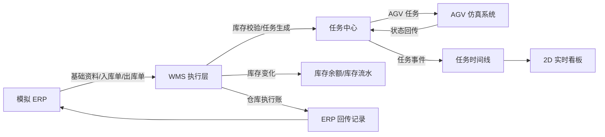
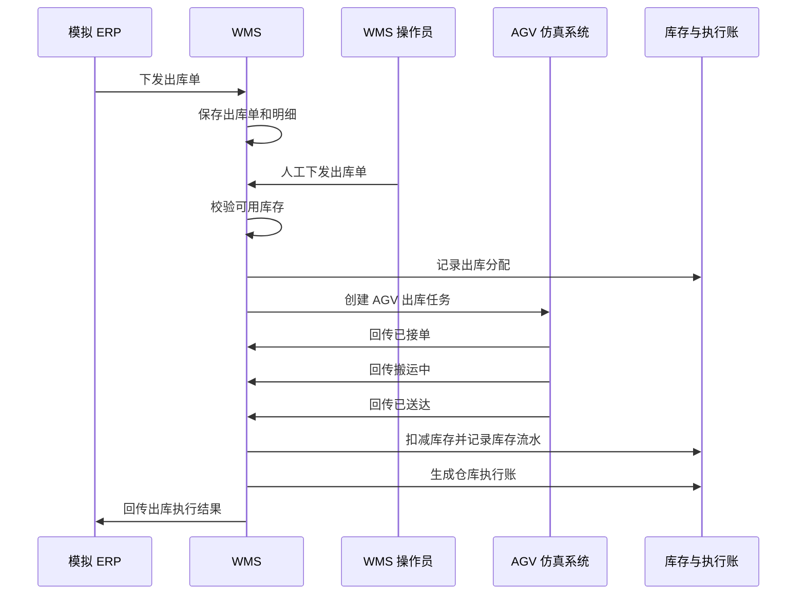
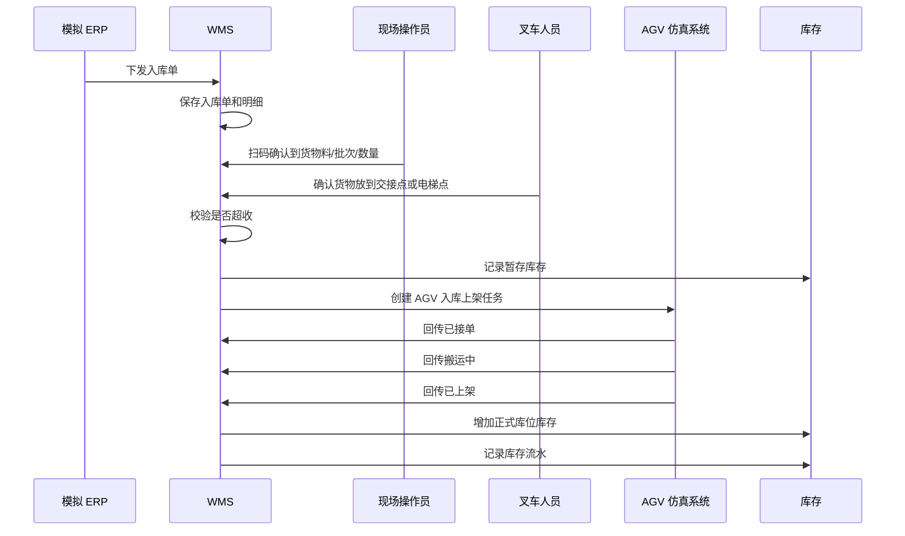
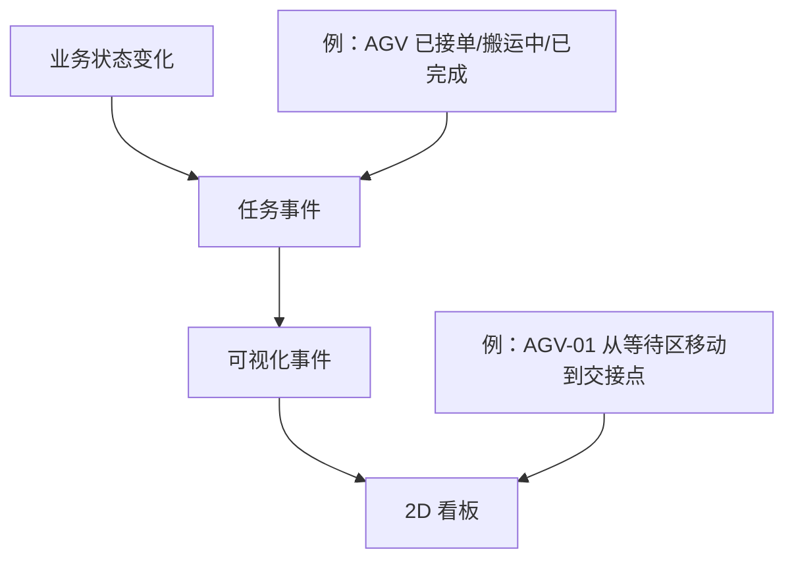

# 业务流程图

## 总体链路

## 出库流程

业务目标：ERP 下发出库需求后，WMS 确认可出库库存，AGV 完成搬运，WMS 扣减库存并回传 ERP 仓库执行账。

出库最小验收示例：

- 初始库存 100。
- 出库单需要出库 20。
- WMS 下发后生成 1 条 AGV 出库任务。
- AGV 完成后库存变成 80。
- 系统生成库存流水、任务时间线和 ERP 回传记录。

## 入库流程

业务目标：ERP 下发入库需求后，现场扫码确认到货，叉车放到交接点，WMS 生成 AGV 上架任务，AGV 完成后库存入正式库位。

入库最小验收示例：

- 入库单应收 100。
- 第一次扫码到货 60。
- 货物放到 HANDOVER-IN-01。
- WMS 生成 1 条 AGV 入库上架任务。
- AGV 完成后目标库位库存增加 60。
- 系统记录暂存、上架、库存流水和任务时间线。

## 任务事件与看板关系

第一版看板不直接读取复杂业务表，而是读取任务事件或可视化事件。

看板后期支持两种模式：

- 实时模式：后端产生事件后推送或被前端轮询，画面即时变化。
- 回放模式：按入库单号、出库单号或 AGV 任务号读取历史事件，按时间顺序重播。
